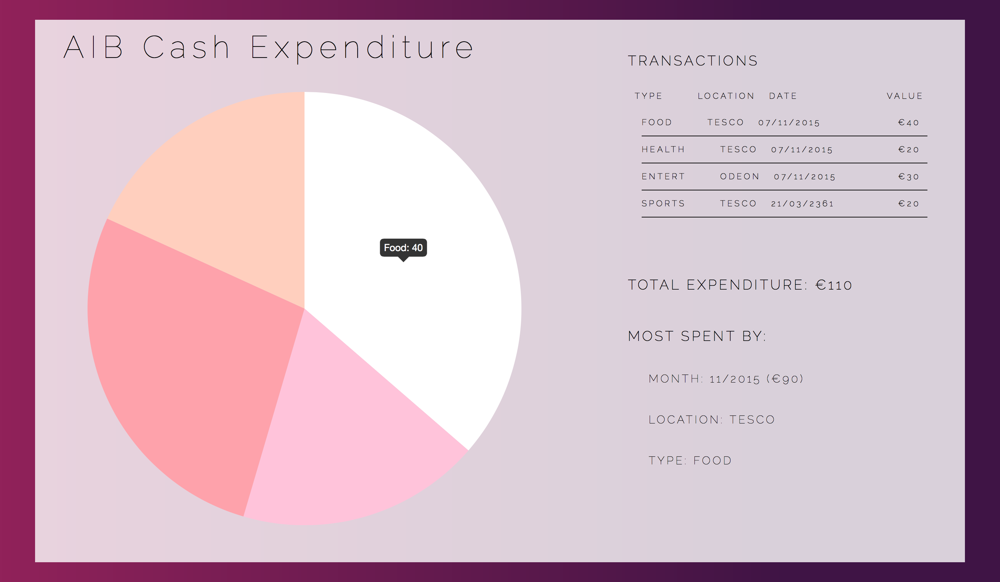

# QR Code Receipt Scanner
For the <a href="https://www.aibdatahack.com">AIB 2015 Hackathon</a> we wanted to build a QR Code Receipt Scanner 
that would be able to be incorporated with the AIB online budgeting and savings portal. We saw a fundamental flaw with their
online budgeting and savings system since it cannot account for Cash transactions which makes budgeting using their online system very hard to do effectively.

We built an Android app that scans the QR codes and then sends the data through a basic API we created which stores the data
in a database and is also hooked up to a website which compiles all this data and displays it. 

We invented a standard for creating these QR codes to comply with our API with the idea that any shop owner could generate them
instead or alongside a receipt for use with our apps.

# Web Portal
The web portal was built using the CodeIgniter framework and is connected to a MySQL database.

The pie chart was created using the <a href="http://chartjs.org">Chart.js</a> and <a href="http://github.com/davidmerfield/randomColor">randomColor.js</a> libraries.
All the information on the right is what's compiled and calculated from the database which is supplied by the Android App.

The API that the App calls to compromises of a single function "update". By following our QR code standard and with our current structure we expect requests like: 
<ul>
  <li>example.com/AIB/home/update/time=1446910715/location=Odeon/currency=euro/Entertainment=30/</li>
  <li>example.com/AIB/home/update/time=1446910715/location=Tesco/currency=euro/Food=40/Health=20/</li>
</ul>

Our standard expects something in the form:
<ul>
  <li>example.com/AIB/home/update/time=UTCTimestamp/location=String/currency=String/Item=Float/…</li>
</ul>
Where you can specify an as many Items as you like, all seperated by forward slashes with whatever type you would like for the Item category as show in the examples above.

Setting the Web Portal up:
<ol>
  <li>Clone the repo</li>
  <li>Move the AIB folder into the htdocs of your server setup</li>
  <li>Import the AIB_db.sql through phpmyadmin or make it yourself</li>
  <li>Set the correct url by changing the base_url in application/config/config.php (at the moment it's set to "localhost/AIB")</li>
</ol>

If you don't have a server setup: XAMPP was used for this project and is easy to get started, ensure you have also have PHP and MySQl installed.

# Android App

